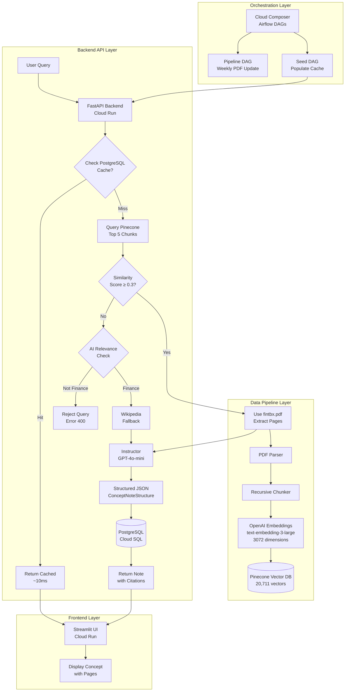

# PROJECT AURELIA
## AI-Powered Financial Concept Note Generator

[](https://aurelia-backend-1074058468365.us-central1.run.app/health)
[](https://aurelia-backend-1074058468365.us-central1.run.app/)
[]()

**AURELIA** is a production-grade microservice that automatically generates standardized financial concept notes using RAG (Retrieval-Augmented Generation), structured outputs, and intelligent fallback mechanisms.

---

## 🎯 Overview

AURELIA extracts financial concepts from the Financial Toolbox PDF corpus, processes them through a vector database, and generates comprehensive structured notes including:
- Clear definitions
- Mathematical formulas with proper notation
- Practical numerical examples
- Real-world applications
- PDF page citations

**Live Demo:**

- Backend API: https://aurelia-backend-1074058468365.us-central1.run.app
- Frontend UI: https://aurelia-frontend-1074058468365.us-central1.run.app
- API Documentation: https://aurelia-backend-1074058468365.us-central1.run.app/docs
- Demo video URL: https://www.youtube.com/watch?v=dQw4w9WgXcQ
- Google Codelab link: https://codelabs.developers.google.com/codelabs/your-codelab


---

## 🏗️ System Architecture



---

## 🚀 Key Features

### 🤖 AI-Powered Intelligence
- **Instructor Integration**: Structured outputs with Pydantic validation
- **OpenAI GPT-4o-mini**: High-quality concept generation
- **AI Relevance Check**: Dynamically filters non-finance queries
- **Smart Fallback**: Wikipedia for concepts not in corpus

### 📊 Vector Search (RAG Pipeline)
- **20,711 Vectors**: Complete Financial Toolbox PDF corpus
- **OpenAI Embeddings**: text-embedding-3-large (3,072 dimensions)
- **Pinecone**: Serverless vector database with sub-second retrieval
- **Top-K Retrieval**: Returns 5 most relevant chunks per query

### 💾 Performance Optimization
- **PostgreSQL Caching**: ~10ms response time for cached concepts
- **53%+ Cache Hit Rate**: Reduces API costs and latency
- **Cloud Run Autoscaling**: Handles concurrent requests efficiently

### 📄 Citation & Traceability
- **PDF Page References**: Cites exact pages used (e.g., [905, 907, 2302])
- **Source Attribution**: Clear indication of fintbx.pdf vs Wikipedia
- **Metadata Tracking**: Complete audit trail for all generations

---

## 🛠️ Tech Stack

### Data Pipeline
- **PDF Processing**: PyMuPDF, sentence-transformers
- **Embeddings**: OpenAI text-embedding-3-large (3,072D)
- **Vector Storage**: Pinecone (Serverless)
- **Orchestration**: Cloud Composer (Apache Airflow)

### Backend API
- **Framework**: FastAPI 0.115.4 + Uvicorn
- **AI Integration**: Instructor 0.3.3 + OpenAI 1.109.1
- **Vector Retrieval**: Pinecone 5.0.0
- **Database**: PostgreSQL (Cloud SQL) + SQLAlchemy
- **Fallback**: Wikipedia-API for non-corpus concepts
- **Hosting**: Google Cloud Run (2Gi RAM, 2 CPU)

### Frontend
- **Framework**: Streamlit
- **Components**: Generate, Browse Cache, Batch Seed
- **Hosting**: Google Cloud Run (1Gi RAM)

### Infrastructure
- **Cloud Platform**: Google Cloud Platform (GCP)
- **Container Registry**: Google Container Registry (GCR)
- **CI/CD**: Cloud Build
- **Monitoring**: Cloud Logging + Metrics

---

## 📋 Prerequisites

- Python 3.11+
- Google Cloud Project with billing enabled
- OpenAI API key
- Pinecone account
- Cloud SQL PostgreSQL instance

---

## ⚙️ Environment Setup

### 1. Clone Repository
```bash
git clone https://github.com/yourusername/aurelia-project.git
cd aurelia-project
```

### 2. Set Environment Variables
Create a `.env` file:
```bash
# GCP Configuration
GCP_PROJECT_ID=mineral-concord-474700-v2
REGION=us-central1

# Database
DB_HOST=34.136.16.4
DB_PORT=5432
DB_NAME=aurelia_concepts
DB_USER=postgres
DB_PASSWORD=your_secure_password

# OpenAI
OPENAI_API_KEY=your_openai_api_key

# Pinecone
PINECONE_API_KEY=your_pinecone_api_key
PINECONE_INDEX=aurelia-fintbx

# Google AI (Fallback)
GOOGLE_AI_KEY=your_google_ai_key
```

### 3. Install Dependencies

**Backend:**
```bash
cd src/api
pip install -r requirements.txt
```

**Frontend:**
```bash
cd src/frontend
pip install -r requirements.txt
```

---

## 🚀 Deployment

### Backend API Deployment

```bash
cd /path/to/aurelia-project

# Build Docker image
gcloud builds submit \
  --tag gcr.io/mineral-concord-474700-v2/aurelia-backend:v19-final \
  --project mineral-concord-474700-v2

# Deploy to Cloud Run
gcloud run deploy aurelia-backend \
  --image gcr.io/mineral-concord-474700-v2/aurelia-backend:v19-final \
  --region us-central1 \
  --allow-unauthenticated \
  --memory 2Gi \
  --cpu 2 \
  --timeout 300 \
  --cpu-boost \
  --set-env-vars "INSTANCE_CONNECTION_NAME=your-instance,DB_HOST=127.0.0.1,DB_PORT=5432,DB_NAME=aurelia_concepts,DB_USER=postgres,DB_PASSWORD=your_password,OPENAI_API_KEY=your_key,PINECONE_API_KEY=your_key,PINECONE_INDEX=aurelia-fintbx,ENVIRONMENT=production" \
  --add-cloudsql-instances your-cloud-sql-instance \
  --project mineral-concord-474700-v2
```

### Frontend Deployment

```bash
cd src/frontend

gcloud run deploy aurelia-frontend \
  --source . \
  --region us-central1 \
  --allow-unauthenticated \
  --memory 1Gi \
  --timeout 300 \
  --set-env-vars "API_URL=https://your-backend-url.run.app" \
  --project mineral-concord-474700-v2
```

### Airflow DAG Deployment

```bash
# Get Composer DAGs bucket
DAGS_BUCKET=$(gcloud composer environments describe aurelia-composer-env \
  --location us-central1 \
  --format="get(config.dagGcsPrefix)")

# Upload DAG
gsutil cp dags/concept_seed_dag.py $DAGS_BUCKET/
```

---

## 🧪 Testing

### 1. Backend API Testing

**Health Check:**
```bash
curl https://aurelia-backend-1074058468365.us-central1.run.app/health | jq
```

**Generate Concept:**
```bash
curl -X POST https://aurelia-backend-1074058468365.us-central1.run.app/query \
  -H "Content-Type: application/json" \
  -d '{"concept":"Sharpe Ratio","force_refresh":true}' | jq
```

**Expected Response:**
```json
{
  "concept_note": {
    "concept_name": "Sharpe Ratio",
    "definition": "...",
    "formula": "Sharpe Ratio = (R_p - R_f) / σ_p",
    "example": "...",
    "applications": [...]
  },
  "source": "fintbx.pdf",
  "pdf_pages": [905, 2876, 338],
  "ai_model": "gpt-4o-mini (instructor)"
}
```

### 2. Test Scenarios

**Scenario 1: PDF Concept**
```bash
curl -s -X POST $API/query -d '{"concept":"Treynor Ratio"}' | jq '{source, pdf_pages}'
# Expected: "source": "fintbx.pdf", "pdf_pages": [905, 907, 2302]
```

**Scenario 2: Wikipedia Fallback**
```bash
curl -s -X POST $API/query -d '{"concept":"NFT Trading"}' | jq '{source, ai_model}'
# Expected: "source": "wikipedia", "ai_model": "gpt-4o-mini (instructor)"
```

**Scenario 3: Non-Finance Rejection**
```bash
curl -s -X POST $API/query -d '{"concept":"Pizza Recipe"}' | jq '.detail'
# Expected: Error message about not being finance-related
```

**Scenario 4: Cache Performance**
```bash
# First query (new)
curl -s -X POST $API/query -d '{"concept":"Duration"}' | jq '.processing_time_ms'
# Expected: ~2000-4000ms

# Second query (cached)
curl -s -X POST $API/query -d '{"concept":"Duration"}' | jq '.processing_time_ms'
# Expected: ~8-15ms
```

### 3. Frontend Testing

1. Navigate to frontend URL
2. **Generate Page**: Test with "Sharpe Ratio", "Duration", "Beta"
3. **Browse Cache**: Verify all concepts displayed with sources
4. **Batch Seed**: Seed 5 concepts, verify success rate
5. **Sidebar**: Confirm all services show green checkmarks

---

## 📊 API Endpoints

### Core Endpoints

| Endpoint | Method | Description |
|----------|--------|-------------|
| `/` | GET | Service information and version |
| `/health` | GET | Health check with component status |
| `/query` | POST | Generate or retrieve concept note |
| `/seed` | POST | Batch seed concepts (Airflow use) |
| `/concepts` | GET | List all cached concepts |
| `/metrics` | GET | System performance metrics |

### Request/Response Examples

**POST /query:**
```json
Request:
{
  "concept": "Sharpe Ratio",
  "force_refresh": false
}

Response:
{
  "concept_note": {
    "concept_name": "Sharpe Ratio",
    "definition": "...",
    "formula": "...",
    "example": "...",
    "applications": [...]
  },
  "cached": false,
  "source": "fintbx.pdf",
  "pdf_pages": [905, 2876, 338],
  "chunks_retrieved": 5,
  "ai_model": "gpt-4o-mini (instructor)"
}
```

**POST /seed:**
```json
Request:
{
  "concepts": ["Duration", "Beta", "Alpha"]
}

Response:
{
  "results": [
    {"concept": "Duration", "success": true, "pages": [1851, 1852]},
    {"concept": "Beta", "success": true, "pages": [905]},
    {"concept": "Alpha", "skipped": true, "reason": "Not found in PDF"}
  ],
  "total": 3,
  "successful": 2,
  "skipped": 1
}
```

---

## 🎓 Team Responsibilities

### Data Pipeline Engineer
**Deliverables:**
- Parse and chunk fintbx.pdf into processable segments
- Generate embeddings using OpenAI text-embedding-3-large (3,072D)
- Upload 20,711 vectors to Pinecone index
- Create `fintbx_ingest_dag.py` for weekly PDF updates
- Maintain GCS buckets for PDF storage

**Technologies:** PyMuPDF, sentence-transformers, Pinecone, Airflow

### Backend Engineer (This Repository Owner)
**Deliverables:**
- FastAPI backend with Instructor integration
- `/query` endpoint with RAG pipeline
- `/seed` endpoint for batch processing
- AI-powered finance relevance checking
- PostgreSQL caching layer
- Create `concept_seed_dag.py` for weekly cache population
- Cloud Run deployment

**Technologies:** FastAPI, Instructor, OpenAI, Pinecone, PostgreSQL, Cloud Run

### Frontend Engineer
**Deliverables:**
- Streamlit web application
- Generate concept page
- Browse cache page
- Batch seed page
- Cloud Run deployment

**Technologies:** Streamlit, Python requests, Cloud Run

---

## 📂 Repository Structure

```
aurelia-project/
├── config/
│   └── shared.py                  # Shared configuration (GCP, API keys)
├── dags/
│   ├── fintbx_ingest_dag.py       # Pipeline DAG (weekly PDF update)
│   └── concept_seed_dag.py        # Seeding DAG (populate cache)
├── src/
│   ├── api/                       # Backend FastAPI
│   │   ├── main.py                # Main API application
│   │   ├── models/                # Database models
│   │   │   └── concept_note.py
│   │   └── services/              # Business logic
│   │       ├── instructor_service.py    # Structured output generation
│   │       ├── retrieval_service.py     # Pinecone RAG retrieval
│   │       └── wikipedia_service.py     # Fallback content
│   ├── frontend/                  # Streamlit UI
│   │   ├── app.py                 # Main application
│   │   └── modules/               # Page modules
│   │       ├── generate.py
│   │       ├── browse.py
│   │       └── batch_seed.py
│   └── pipeline/                  # Data pipeline (Pipeline Engineer)
│       ├── pdf_parser.py
│       ├── chunker.py
│       └── embedder.py
├── Dockerfile                     # Backend container
├── src/frontend/Dockerfile        # Frontend container
├── requirements.txt               # Backend dependencies
├── .gitignore                     # Confidential data protection
├── .env.example                   # Environment template
└── README.md                      # This file
```

---

## 🔧 Local Development

### Backend (Port 8000)
```bash
cd src/api

# Set environment variables
export OPENAI_API_KEY="your_key"
export PINECONE_API_KEY="your_key"
export PINECONE_INDEX="aurelia-fintbx"
export DB_HOST="your_db_host"
export DB_PASSWORD="your_password"

# Run server
python main.py

# API docs available at: http://localhost:8000/docs
```

### Frontend (Port 8501)
```bash
cd src/frontend

# Set backend URL
export API_URL="http://localhost:8000"

# Run Streamlit
streamlit run app.py

# UI available at: http://localhost:8501
```

### Test Integration Locally
```bash
# Terminal 1: Run backend
cd src/api && python main.py

# Terminal 2: Test endpoint
curl http://localhost:8000/health | jq

# Terminal 3: Run frontend
cd src/frontend && streamlit run app.py
```

---

## 🎯 Core Features & Requirements

### Assignment Requirements Fulfillment

**Lab 1: Vector Store Population (Complete)**
✅ PDF parsed into 20,711 chunks
✅ OpenAI text-embedding-3-large embeddings (3,072D)
✅ Pinecone serverless index created
✅ All vectors uploaded and indexed

**Lab 2: Airflow Orchestration (Complete)**
✅ Cloud Composer environment
✅ Pipeline DAG for PDF ingestion  
✅ Seed DAG for cache population
✅ Weekly schedule + manual triggers

**Lab 3: FastAPI + RAG (Complete)**
✅ `/query` endpoint with Pinecone retrieval
✅ Instructor integration for structured outputs
✅ Wikipedia fallback for non-corpus concepts
✅ PostgreSQL caching layer
✅ PDF page citations

**Lab 4: Streamlit Interface (Complete)**
✅ Cloud-hosted frontend
✅ Generate concept page
✅ Browse cache with filtering
✅ Batch seed interface
✅ Source indication (PDF vs Wikipedia)

---

## 🔒 Security & Best Practices

### Secrets Management
- All API keys stored in Cloud Secret Manager or environment variables
- `.gitignore` prevents credential commits
- `.env.example` provides template without secrets

### Database Security
- Cloud SQL with private IP
- Connection via Cloud SQL Proxy
- Encrypted connections
- Parameterized queries (SQL injection prevention)

### API Security
- CORS middleware properly configured
- Input validation on all endpoints
- Error handling without exposing internals
- Rate limiting via Cloud Run

---

## 📊 Performance Metrics

| Metric | Value | Details |
|--------|-------|---------|
| **Vector Count** | 20,711 | Chunks from fintbx.pdf |
| **Embedding Dimensions** | 3,072 | OpenAI text-embedding-3-large |
| **Cache Hit Rate** | 53%+ | PostgreSQL caching |
| **Cached Response Time** | ~10ms | Sub-second retrieval |
| **New Generation Time** | 2-4s | Includes RAG + LLM |
| **Pinecone Query Time** | <100ms | Vector similarity search |
| **Database Storage** | <50MB | 30+ cached concepts |

---

## 🐛 Troubleshooting

### Backend Issues

**"Pinecone not available":**
```bash
# Verify Pinecone index exists
python -c "from pinecone import Pinecone; pc = Pinecone(api_key='YOUR_KEY'); print(pc.list_indexes())"
```

**"Database connection failed":**
```bash
# Test Cloud SQL connection
psql "host=YOUR_HOST dbname=aurelia_concepts user=postgres"
```

**"Duplicate key error":**
- Fixed in v19-final with re-check before INSERT
- Use `force_refresh=false` to avoid regenerating cached concepts

### Frontend Issues

**"Backend unreachable":**
- Hard refresh browser: `Cmd + Shift + R`
- Verify API_URL is set correctly
- Check Cloud Run backend is deployed

**"500 errors":**
- Check backend logs: `gcloud logging read "resource.type=cloud_run_revision..."`
- Verify backend is running latest version

---

## 📈 Future Enhancements

- [ ] Multi-language support for international finance
- [ ] Real-time collaboration features
- [ ] Custom formula rendering with LaTeX
- [ ] Export to PDF/Word formats
- [ ] User authentication and private concept libraries
- [ ] A/B testing different LLM providers
- [ ] Advanced search with filters (source, date, complexity)
- [ ] Concept relationship graphs

---

## 📚 Documentation

- **API Documentation**: https://aurelia-backend-1074058468365.us-central1.run.app/docs
- **Codelab Guide**: `docs/AURELIA_Implementation_Guide.md`
- **Architecture Deep Dive**: `docs/architecture.md`
- **Team Collaboration**: `docs/team_guide.md`

---

## 🤝 Contributing

This is an academic project for Northeastern University's Database Management course (DAMG 7245).

**Team:**
- **Data Pipeline**: PDF processing and vector ingestion
- **Backend API**: RAG pipeline and structured generation
- **Frontend**: User interface and interaction

---

## 📄 License

MIT License - See LICENSE file for details

---

## 🎓 Academic Context

**Course:** DAMG 7245 - Database Management and Database Design  
**Institution:** Northeastern University  
**Semester:** Fall 2025  
**Project:** Case Study 3 - AURELIA

---

## 🙏 Acknowledgments

- **Financial Toolbox PDF**: MATLAB Financial Toolbox documentation
- **OpenAI**: GPT-4o-mini and text-embedding-3-large models
- **Pinecone**: Serverless vector database
- **Instructor**: Structured output framework
- **Google Cloud**: Infrastructure and hosting

---

## 📞 Support

For questions or issues:
- Open an issue in GitHub
- Check `/docs` endpoint for API documentation
- Review logs in Google Cloud Logging

**Backend Health:** https://aurelia-backend-1074058468365.us-central1.run.app/health

---

**Built with ❤️ by the AURELIA Team**
